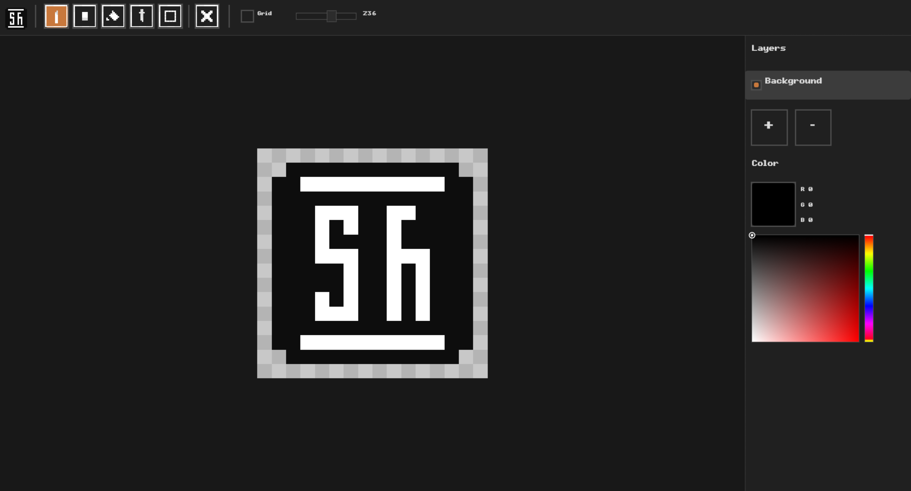

# Pixesh

A minimal pixel art editor built with Rust and egui.



## Features

- **Drawing tools** — Brush, Eraser, Fill, Eyedropper
- **Selection** — Rectangular select, move pixels, delete
- **Layers** — Add/remove layers, toggle visibility
- **HSV color picker** — Saturation/Value field + Hue strip
- **Canvas resize** — Change dimensions at any time
- **Export PNG** — Save your artwork
- **Grid overlay** — Toggle pixel grid
- **Zoom & pan** — Scroll to zoom, arrows to pan
- **Mirror** — Flip active layer horizontally/vertically with toolbar buttons
- **Undo / Redo** — Ctrl+Z / Ctrl+Y (up to 50 steps)

## Controls

| Key | Action |
|-----|--------|
| `B` | Brush |
| `E` | Eraser |
| `G` | Fill |
| `R` | Select |
| `F` | Brush size dialog |
| `Delete` | Clear selection |
| `Escape` | Deselect / close dialogs |
| `Ctrl+Z` | Undo |
| `Ctrl+Y` | Redo |
| `Ctrl+S` | Export PNG |
| `Ctrl+L` | Load PNG |
| `Ctrl+R` | Resize canvas |
| `Scroll` | Zoom |
| `Shift+Scroll` | Brush size |
| `Right-click + drag` | Eraser |

## Build

```bash
cargo build --release
```

Run with:

```bash
./target/release/pixesh
```

## Project Structure

- `src/main.rs` — Entry point, font & style setup
- `src/app/` — Core application logic
  - `mod.rs` — App state (layers, color, tools, undo, selection)
  - `canvas.rs` — Compositing, pixel painting, Bresenham lines, flood fill, mirror
  - `history.rs` — Undo/redo with snapshots
  - `input.rs` — Keyboard shortcuts, zoom, pan
  - `io.rs` — Save/load PNG, layer management, canvas resize
  - `panel_canvas.rs` — Canvas rendering, tool dispatch
  - `panel_dialogs.rs` — Resize, Export, Brush Size dialogs
  - `panel_layers.rs` — Layers panel, HSV color picker
  - `panel_toolbar.rs` — Toolbar with tool icons, grid toggle, zoom slider
  - `tools.rs` — Tool handlers (brush, fill, eyedropper, selection)
- `src/color.rs` — HSV ↔ RGB conversion
- `src/constants.rs` — Colors, sizes, Tool enum
- `src/ui.rs` — Custom widgets (button, icon button, checkbox, slider)
- `tex/` — Tool icons
- `screenshots/` — Screenshots
